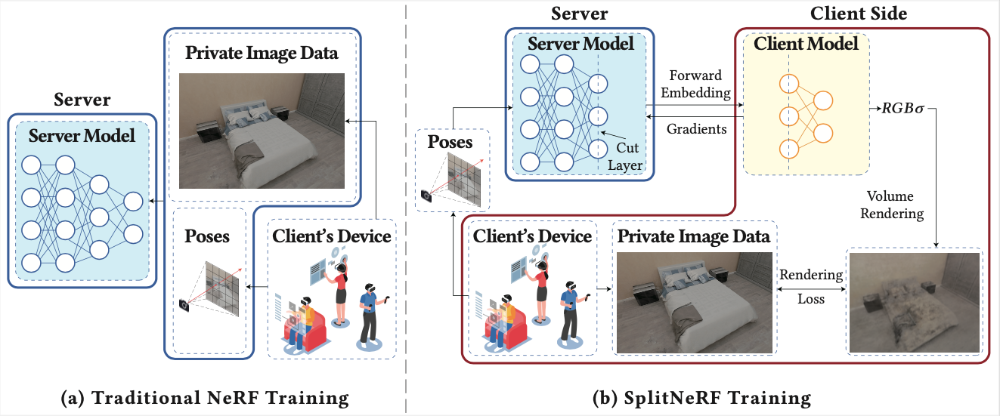

# $S^2$ NeRF

## Abstract

*Neural Radiance Fields* (NeRF) have revolutionized 3D computer vision and graphics, facilitating novel view synthesis and influencing sectors like extended reality and e-commerce. However, NeRF's dependence on extensive data collection, including sensitive scene image data, introduces significant privacy risks when users upload this data for model training. To address this concern, we first propose SplitNeRF, a training framework that incorporates *split learning* (SL) techniques to enable privacy-preserving collaborative model training between clients and servers without sharing local data. Despite its benefits, we identify vulnerabilities in SplitNeRF by developing two attack methods, Surrogate Model Attack and Scene-aided Surrogate Model Attack, which exploit the shared gradient data and a few leaked scene images to reconstruct private scene information. To counter these threats, we introduce $S^2$ NeRF, secure SplitNeRF that integrates effective defense mechanisms. By introducing decaying noise related to the gradient norm into the shared gradient information, $S^2$ NeRF preserves privacy while maintaining a high utility of the NeRF model. Our extensive evaluations across multiple datasets demonstrate the effectiveness of $S^2$ NeRF against privacy breaches, confirming its viability for secure NeRF training in sensitive applications.


## Overview of $S^2$ NeRF


## Installation

### Get source code

```bash
git clone https://github.com/lucky9-cyou/S2-NeRF.git
cd S2-NeRF
```

### Install with conda

```bash
conda env create -f environment.yml
conda activate s2-nerf
```

### Build extension

By default, we use load to build the extension at runtime. However, this may be inconvenient sometimes. Therefore, we also provide the setup.py to build each extension:

```bash
# install all extension modules
bash scripts/install.sh

# if you want to install manually, here is an example:
cd raymarching
python setup.py build_ext --inplace # build ext only, do not install (only can be used in the parent directory)
pip install . # install to python path (you still need the raymarching/ folder, since this only install the built extension.)
```

## Usage

### Naive NeRF

Without attack and defense, simply training nerf models:

```bash
python main_nerf.py /path/to/data --workspace /path/to/workspace --preload
```

### Surrogate Model Attack

With attack, training nerf models:

```bash
python main_nerf.py /path/to/data --workspace /path/to/workspace --preload --add_dummy --dummy_layer=4 --dummy_lr_decay=0.001 --lambda_grad=1e-2 --eval_interval=5
```

### Surrogate Model Attack and $S^2$ NeRF

With attack and gradient noise, training nerf models:
```bash
python main_nerf.py /path/to/data --workspace /path/to/workspace --preload --add_dummy --dummy_layer=4 --dummy_lr_decay=0.001 --lambda_grad=1e-2 --eval_interval=5 --add_noise --noise_type=random --noise_std=9.6 --noise_layer=4 --noise_decay=1
```

### Surrogate Model Attack and Label Noise

With attack and label noise, training nerf models:
```bash
python main_nerf.py /path/to/data --workspace /path/to/workspace --preload --add_dummy --dummy_layer=4 --dummy_lr_decay=0.001 --lambda_grad=1e-2 --eval_interval=5 --add_label_noise --label_noise_std=8
```

### Scene-aided Surrogate Model Attack

```bash
python main_nerf.py /path/to/data --workspace /path/to/workspace --preload --add_dummy --dummy_layer=4 --dummy_lr_decay=0.001 --lambda_grad=1e-2 --eval_interval=5 --inerf
```

## Acknowledgement
```
@article{mueller2022instant,
    title = {Instant Neural Graphics Primitives with a Multiresolution Hash Encoding},
    author = {Thomas M\"uller and Alex Evans and Christoph Schied and Alexander Keller},
    journal = {arXiv:2201.05989},
    year = {2022},
    month = jan
}

@misc{torch-ngp,
    Author = {Jiaxiang Tang},
    Year = {2022},
    Note = {https://github.com/ashawkey/torch-ngp},
    Title = {Torch-ngp: a PyTorch implementation of instant-ngp}
}
```
